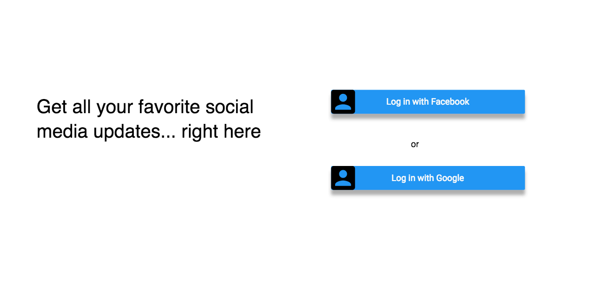
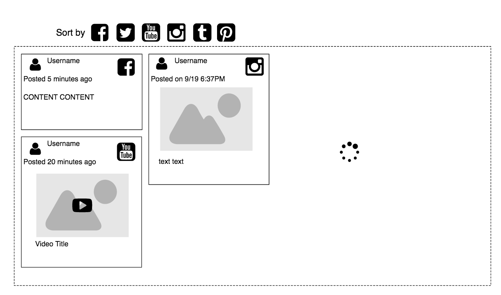

## #Everything

### Background

Everyone on the internet is inundated with new information and updates. Wouldn’t it be great if you can just check on place for all new updates that you care about, and have it be highly customizable? This application replaces the need to check all the applications and websites that you follow as it centralizes all the information in one place.

Our application will provide a list of sources that users can add to their feed, such as youtube, news, etc. Our application will also provide a framework api that a user can add different plugins to personalize their feed further. If a user would like to create a specific source for their own feed, a user can implement their own plugins that can be used with our framework api.

Development of the features in this application will be guided by different apis for the plugins, such as youtube api or Hack news RSS feed. Reddis cache would be also used to store temporary aggregated data.

(It’s kind of like feedly but for social media feeds)

### Functionality & MVP

With this application, users will be able to:

- [ ] Gather all news feed into one, consistent looking feed,
- [ ] Customizable application list,
- [ ] The option for users to customize their feed further by implementing their own plugins for our framework

### Bonus Features

- [ ] Refresh to fetch new data
- [ ] Mark as read and favoriting posts
- [ ] Have the feeds open up to the post in the original app and also allow posting to post directly to the original app

### Wireframes

### Technologies & Technical Challenges

This application will be implemented with React.js for the frontend, and Rails for back-end server.

Back-end:

Several files for plug-ins

OmniAuth for 3rd party authentication
https://github.com/intridea/omniauth

### Implementation Timeline

**Day 1**: Get backend setup and user sign up mechanism (through facebook, twitter, or google account)  Goals by the end of the day:

- A completed `package.json`
- Rails backend setup for auth system (through a third party app such as facebook)
- Database tables schema ready

**Day 2**: Work on getting the framework to take in data from plugins and parse it into the frontend. Work on the home page of the front end. Goals:

- Writing a small sample plugin
- Writing the parsing of the plugin result to show on the frontend
- Work on showing different categories feed on the home page

**Day 3**: Work on writing a plugin with api that the framework can use for signing up. Work on adding different sources (plugins) to different feeds on the front end. By the end of the day:

- Getting the access token from an user and pass it to the framework
- adding different categories in the news_feed
- side bar component
- reddis cache for storing temporary data

**Day 4**: Work on creating the infinite scroll for the news feed, work on the newsfeed page of each category. Work on the second sample plugin. By the end of the day:

- infinite scroll for the news feed, working with the cache to achieve that
- write a second sample plugin and fetch data from another api

**Day 5**: Styling the app with CSS, make sure everything works together.
- Add smooth CSS transitions
- if time permits, bonus features would be implemented.
