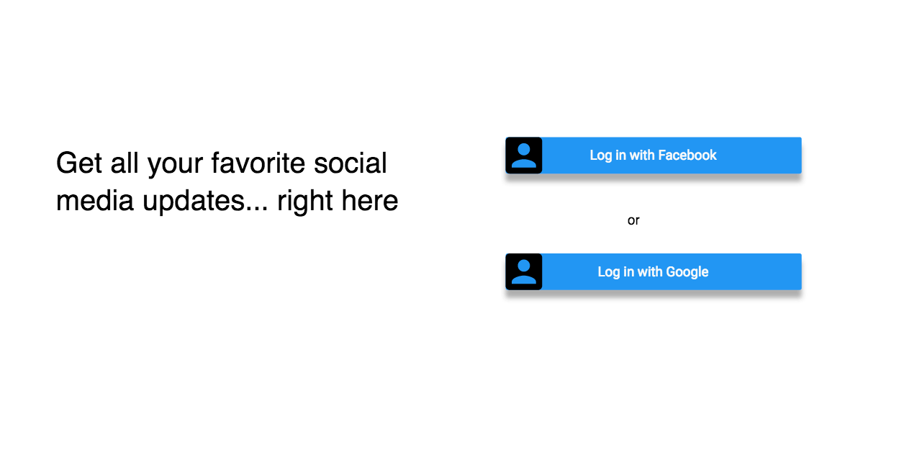
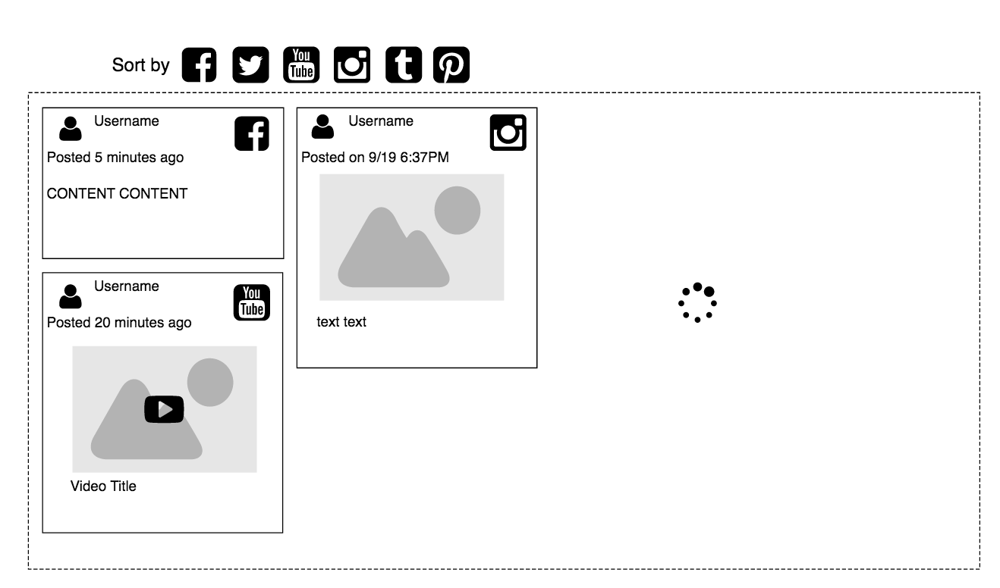

## #Everything

### Background

Everyone on the internet is inundated with new information and updates. Wouldn’t it be great if you can just check on place for all new updates that you care about, and have it be highly customizable? This application replaces the need to check all the applications and websites that you follow as it centralizes all the information in one place.

Our application will provide a list of sources that users can add to their feed, such as youtube, news, etc. Our application will also provide a framework api that a user can add different plugins to personalize their feed further. If a user would like to create a specific source for their own feed, a user can implement their own plugins that can be used with our framework api.

Development of the features in this application will be guided by different apis for the plugins, such as youtube api or ny times api

(It’s kind of like feedly but for social media feeds)

### Functionality & MVP

With this application, users will be able to:

- [ ] Gather all news feed into one, consistent looking feed,
- [ ] Customizable applications and dashboard,
- [ ] The option for users to customize their feed further by implementing their own plugins for our framework

### Bonus Features

- [ ] Refresh to fetch new data
- [ ] Mark as read and favoriting posts
- [ ] Have the feeds open up to the post in the original app and also allow posting to post directly to the original app

### Wireframes

### Technologies & Technical Challenges

This application will be implemented with React.js for the frontend, and Rails for back-end server.

Back-end:

Several files for plug-ins

OmniAuth for 3rd party authentication
https://github.com/intridea/omniauth

### Implementation Timeline

**Day 1**: Get backend setup and user sign up mechanism (through facebook, twitter, or google account)  Goals by the end of the day:

- A completed `package.json`
-
-

**Day 2**: Work on identifying the colors used in the DOM by class and other attributes, and create and render a new DOM with different colors.  By the end of the day, I will have:

- The ability to identify all colors
- A new HTML file that gets rendered in place of the current DOM, using different colors

**Day 3**: Dedicate this day to correctly replacing colors with their grey scale or high-contrast equivalents.  By the end of the day:

- Implement an algorithm for replacing colors with grey scale tones
- At least understand (and hopefully implement) and algorithm for replacing colors with high-contrast equivalents
- Render a new DOM that contains each of these color equivalents

**Day 4**: Create the settings page and connect the settings to the color change logic.  If time, create high-contrast grey scale and low-contrast algorithms as well.  By the end of the day:

- Fully implemented settings changes that re-render a differently colored DOM
- If time, implement the final two features: normal color to low contrast and normal to high-contrast grey scale

**Day 5**: Styling the app with CSS.
